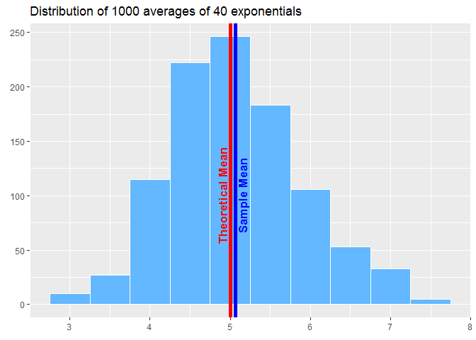
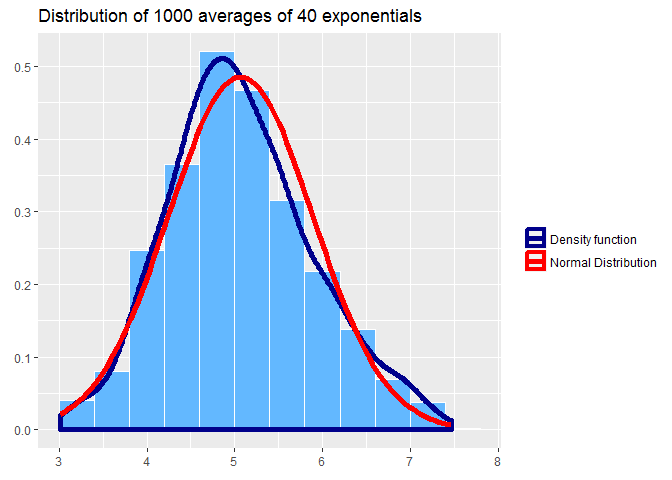
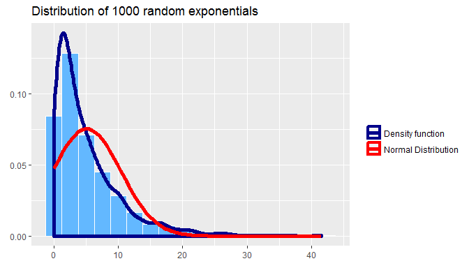

# Analysis of the exponential distribution in R and comparing it with the Central Limit Theorem


###_Vadim K._ 
####_2017-01-08_

## Overview
This project is aimed to investigate the exponential distribution in R and compare it with the Central Limit Theorem. We make a simulation of 1000 averages of 40 exponentials and illustrate the properties of the obtained distribution (sample mean and variance are compared with theoretical ones).  
We also show that the obtained distribution is approximately normal which complies with Central Limit Theorem.

##Simulations
We take the rate parameter 'lambda' for the exponential distribution equal 0.2.

```r
lambda <- 0.2
```

Theoretical mean of exponential distribution is 1/lambda and the standard deviation is also 1/lambda.

```r
mu <- 1/lambda
sigma <- 1/lambda
```

Sample size is 40

```r
n <- 40
```

And the number of simulations is 1000

```r
nosim <- 1000
```

We generate a matrix called 'sample' of random exponentials with given parameters. 

```r
set.seed(11142)
sample <- matrix(rexp(nosim * n, rate = lambda), nosim, n)
```

The dimentions of the matrix are 1000 rows by 40 columns 

```r
dim(sample)
```

```
## [1] 1000   40
```


##Sample Mean versus Theoretical Mean
From simulated data we generate a vector called 'sample_means' of 1000 averages of 40 exponentials

```r
sample_means <- apply(sample, 1, mean)
```

Now we can plot the histogram of sample distribution overlapping it with theoretical mean and observed mean of the sample averages (we'll use 'ggplot2' package in this project)

```r
suppressWarnings(suppressMessages(library(ggplot2)))
```


```r
print(g1)
```

<!-- -->

As we can see the distribution of averages is centered at the theoretical mean.  
Mean of the simulated averages is equal 5.067 which is very close to theoretical one:

```r
data.frame("Theretical Mean" = mu, "Sample.Mean" = mean(sample_means))
```

```
##   Theretical.Mean Sample.Mean
## 1               5    5.067507
```


##Sample Variance versus Theoretical Variance
From simulated data we generate a vector called 'sample_vars' holding 1000 variances of 40 exponentials


```r
sample_vars <- apply(sample, 1, var)
```

Now we can plot the histogram of sample variances distribution overlapping it with theoretical variance and observed mean of the sample variances


```r
print(g2)
```

<!-- -->

As we can see the distribution of variances is centered at the theoretical variance.    
Mean of the simulated variances is equal 25.84 which is very close to theoretical one:

```r
data.frame("Theretical Variance" = sigma^2, "Mean of Sample Var" = mean(sample_vars))
```

```
##   Theretical.Variance Mean.of.Sample.Var
## 1                  25           25.84083
```

##Distribution
Now let's illustrate approximate normality of distribution of a large collection of averages of 40 exponentials.  
In order to do it we will plot again a histogram of 1000 averages together with its density function, overlapping with Normal distribution with mean and standard deviation equal those from sample data.


```r
print(g3)
```

<!-- -->

As we can see that's very close to normal, comparing to the distribution of a large collection of random exponentials (see below)


```r
print(g4)
```

<!-- -->

Thus, we can conclude that the distribution of the means of 40 exponentials behaves as predicted by **Central Limit Theorem**.


\pagebreak

#APPENDIX 1

Here the full code for the plots


```r
g1 <- ggplot(data.frame(sample_means), aes(x = sample_means)) + 
      geom_histogram(binwidth = 0.5, color = "white", fill = "steelblue1") +
      labs(list(title = "Distribution of 1000 averages of 40 exponentials", 
                x = element_blank(),
                y = element_blank())) +
      geom_vline(xintercept = mu, color = "red", size = 2) +
      geom_vline(xintercept = mean(sample_means), color = "blue", size = 2) +
      annotate("text", label = "Theoretical Mean", 
               fontface = "bold", color = "red", 
               x = 4.9, y = 100, size = 4.5, angle = 90) + 
      annotate("text", label = "Sample Mean", 
               fontface = "bold", color = "blue", 
               x = 5.15, y = 100, size = 4.5, angle = 90)
```


```r
g2 <- ggplot(data.frame(sample_vars), aes(x = sample_vars)) + 
      geom_histogram(binwidth = 6, color = "white", fill = "steelblue1") +
      labs(list(title = "Distribution of 1000 variances of 40 exponentials", 
                x = element_blank(),
                y = element_blank())) +
      geom_vline(xintercept = sigma^2, color = "red", size = 2) +
      geom_vline(xintercept = mean(sample_vars), color = "blue", size = 2) +
      annotate("text", label = "Theoretical Variance", 
               fontface = "bold", color = "red", 
               x = 23, y = 100, size = 4.5, angle = 90) + 
      annotate("text", label = "Mean of sample variances", 
               fontface = "bold", color = "blue", 
               x = 27, y = 100, size = 4.5, angle = 90)
```


```r
g3 <- ggplot(data.frame(sample_means), aes(x = sample_means)) + 
      geom_histogram(binwidth = 0.4, color = "white", fill = "steelblue1", aes(y = ..density..)) +
      labs(list(title = "Distribution of 1000 averages of 40 exponentials", 
                x = element_blank(),
                y = element_blank())) +
      geom_density(size = 2, aes(color = "1")) + 
      stat_function(fun = dnorm, args = list(mean = mean(sample_means), 
                                             sd = sd(sample_means)), 
                    size = 2, aes(color = "2")) + 
      scale_color_manual(values = c("blue4", "red"),
                         labels = c("Density function",
                                    "Normal Distribution"),
                         name = "")
```


```r
rand_exp <- rexp(1000, lambda)

g4 <- ggplot(data.frame(rand_exp), aes(x = rand_exp)) + 
      geom_histogram(binwidth = 2.5, color = "white", fill = "steelblue1", aes(y = ..density..)) +
      labs(list(title = "Distribution of 1000 random exponentials", 
                x = element_blank(),
                y = element_blank())) +
      geom_density(size = 2, aes(color = "1")) + 
      stat_function(fun = dnorm, args = list(mean = mean(rand_exp), 
                                             sd = sd(rand_exp)), 
                    size = 2, aes(color = "2")) + 
      scale_color_manual(values = c("blue4", "red"),
                         labels = c("Density function",
                                    "Normal Distribution"),
                         name = "")
```


