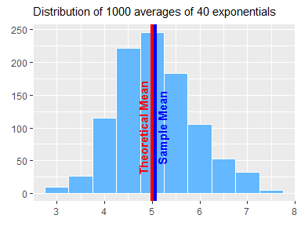

# Analysis of the exponential distribution in R and comparing it with the Central Limit Theorem


###_Vadim K._ 
####_2017-01-08_

## Overview
This project is aimed to investigate the exponential distribution in R and compare it with the Central Limit Theorem. We make a simulation of 1000 averages of 40 exponentials and illustrate the properties of the obtained distribution (sample mean and variance are compared with theoretical ones).  
We also show that the obtained distribution is approximately normal.

##Simulations
We take the rate parameter 'lambda' for the exponential distribution equal 0.2.

```r
lambda <- 0.2
```

Theoretical mean of exponential distribution is 1/lambda and the standard deviation is also 1/lambda.

```r
mu <- 1/lambda
sigma <- 1/lambda
```

Sample size is 40

```r
n <- 40
```

And the number of simulations is 1000

```r
nosim <- 1000
```

We generate a matrix called 'sample' of random exponentials with given parameters. 

```r
set.seed(11142)
sample <- matrix(rexp(nosim * n, rate = lambda), nosim, n)
```

The dimentions of the matrix are 1000 rows by 40 columns 

```r
dim(sample)
```

```
## [1] 1000   40
```


##Sample Mean versus Theoretical Mean
From simulated data we generate a vector called 'sample_means' of 1000 averages of 40 exponentials

```r
sample_means <- apply(sample, 1, mean)
```

Now we can plot the histogram of sample means overla================

```r
library(ggplot2)
```

```
## Warning: package 'ggplot2' was built under R version 3.3.2
```

```r
g <- ggplot(data.frame(sample_means), aes(x = sample_means)) + 
      geom_histogram(binwidth = 0.5, color = "white", fill = "steelblue1") +
      geom_vline(xintercept = mu, color = "red", size = 2) +
      geom_vline(xintercept = mean(sample_means), color = "blue", size = 2) +
      annotate("text", label = "plot mpg vs. wt", x = 4.9, y = 100, size = 4.5, angle = 90)
      
print(g)
```

<!-- -->

```r
length(colors())
```

```
## [1] 657
```


So our sample mean is equal 5.067

```r
mean(sample_means)
```

```
## [1] 5.067507
```

Which is very close to theoretical means


